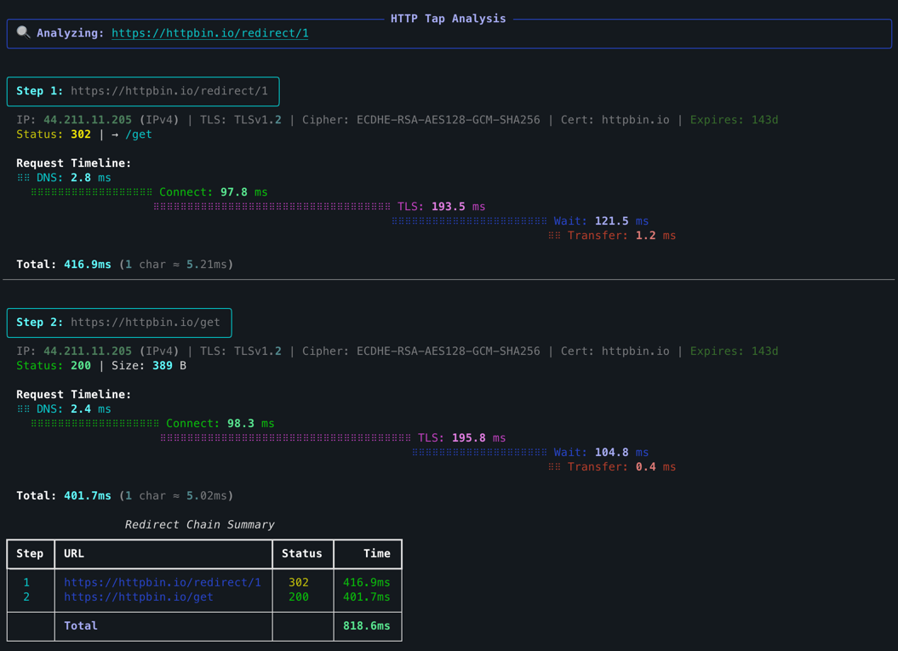

# httptap

<table>
  <tr>
    <th>Releases</th>
    <th>CI &amp; Analysis</th>
    <th>Project Info</th>
  </tr>
  <tr>
    <td>
      <a href="https://pypi.org/project/httptap/">
        
      </a><br />
      <a href="https://pypi.org/project/httptap/">
        
      </a>
    </td>
    <td>
      <a href="https://github.com/ozeranskii/httptap/actions/workflows/ci.yml">
        
      </a><br />
      <a href="https://github.com/ozeranskii/httptap/actions/workflows/codeql.yml">
        
      </a><br />
      <a href="https://codecov.io/github/ozeranskii/httptap">
        
      </a>
    </td>
    <td>
      <a href="https://github.com/astral-sh/uv">
        
      </a><br />
      <a href="https://github.com/astral-sh/ruff">
        
      </a><br />
      <a href="https://github.com/ozeranskii/httptap/blob/main/LICENSE">
        
      </a>
    </td>
  </tr>
</table>

`httptap` is a rich-powered CLI that dissects an HTTP request into every meaningful phase-DNS, TCP connect, TLS
handshake, server wait, and body transfer and renders the results as a timeline table, compact summary, or
machine-friendly metrics. It is designed for interactive troubleshooting, regression analysis, and recording of
performance baselines.

---

## Highlights

- **Phase-by-phase timing** – precise measurements built from httpcore trace hooks (with sane fallbacks when metal-level
  data is unavailable).
- **IPv4/IPv6 aware** – the resolver and TLS inspector report both the address and its family.
- **TLS insights** – certificate CN, expiry countdown, cipher suite, and protocol version are captured automatically.
- **Multiple output modes** – rich waterfall view, compact single-line summaries, or `--metrics-only` for scripting.
- **JSON export** – persist full step data (including redirect chains) for later processing.
- **Extensible** – clean Protocol interfaces for DNS, TLS, timing, visualization, and export so you can plug in custom
  behavior.

---

## Requirements

- Python 3.13 (CPython; 3.13+ targeted as primary runtime)
- macOS, Linux, or Windows (tested on CPython)
- No system dependencies beyond standard networking
- Code must follow the Google Python Style Guide (docstrings, formatting). See
  [Google Python Style Guide](https://google.github.io/styleguide/pyguide.html)

---

## Installation

### Using `uv`

```shell
uv pip install httptap
```

### From source

```shell
git clone https://github.com/ozeranskii/httptap.git
cd httptap
uv pip install .
```

---

## Quick Start

Currently `httptap` issues a `GET` request and streams the entire response body. Other HTTP methods and payloads are not
supported yet; this keeps the interface simple and avoids exposing sensitive request data in output. If you need to
profile `POST`/`PUT` workloads, you can wrap `httptap` and override the request executor to plug in custom behavior.

Run a single request and display a rich waterfall:

```shell
httptap https://httpbin.io
```

Add custom headers (repeat `-H` for multiple values):

```shell
httptap \
  -H "Accept: application/json" \
  -H "Authorization: Bearer super-secret" \
  https://httpbin.io/bearer
```

Follow redirect chains and dump metrics to JSON:

```shell
httptap --follow --json out/report.json https://httpbin.io/redirect/2
```

Collect compact (single-line) timings suitable for logs:

```shell
httptap --compact https://httpbin.io/get
```

Expose raw metrics for scripts:

```shell
httptap --metrics-only https://httpbin.io/get | tee timings.log
```

---

## Sample Output


The redirect summary includes a total row:


---

## JSON Export Structure

```json
{
  "initial_url": "https://httpbin.io/redirect/2",
  "total_steps": 3,
  "steps": [
    {
      "url": "https://httpbin.io/redirect/2",
      "step_number": 1,
      "timing": {
        "dns_ms": 8.947208058089018,
        "connect_ms": 96.97712492197752,
        "tls_ms": 194.56583401188254,
        "ttfb_ms": 445.9513339679688,
        "total_ms": 447.3437919514254,
        "wait_ms": 145.46116697601974,
        "xfer_ms": 1.392457983456552,
        "is_estimated": false
      },
      "network": {
        "ip": "44.211.11.205",
        "ip_family": "IPv4",
        "tls_version": "TLSv1.2",
        "tls_cipher": "ECDHE-RSA-AES128-GCM-SHA256",
        "cert_cn": "httpbin.io",
        "cert_days_left": 143
      },
      "response": {
        "status": 302,
        "bytes": 0,
        "content_type": null,
        "server": null,
        "date": "2025-10-23T19:20:36+00:00",
        "location": "/relative-redirect/1",
        "headers": {
          "access-control-allow-credentials": "true",
          "access-control-allow-origin": "*",
          "location": "/relative-redirect/1",
          "date": "Thu, 23 Oct 2025 19:20:36 GMT",
          "content-length": "0"
        }
      },
      "error": null,
      "note": null
    },
    {
      "url": "https://httpbin.io/relative-redirect/1",
      "step_number": 2,
      "timing": {
        "dns_ms": 2.6895420160144567,
        "connect_ms": 97.51500003039837,
        "tls_ms": 193.99016606621444,
        "ttfb_ms": 400.2034160075709,
        "total_ms": 400.60841606464237,
        "wait_ms": 106.00870789494365,
        "xfer_ms": 0.4050000570714474,
        "is_estimated": false
      },
      "network": {
        "ip": "44.211.11.205",
        "ip_family": "IPv4",
        "tls_version": "TLSv1.2",
        "tls_cipher": "ECDHE-RSA-AES128-GCM-SHA256",
        "cert_cn": "httpbin.io",
        "cert_days_left": 143
      },
      "response": {
        "status": 302,
        "bytes": 0,
        "content_type": null,
        "server": null,
        "date": "2025-10-23T19:20:36+00:00",
        "location": "/get",
        "headers": {
          "access-control-allow-credentials": "true",
          "access-control-allow-origin": "*",
          "location": "/get",
          "date": "Thu, 23 Oct 2025 19:20:36 GMT",
          "content-length": "0"
        }
      },
      "error": null,
      "note": null
    },
    {
      "url": "https://httpbin.io/get",
      "step_number": 3,
      "timing": {
        "dns_ms": 2.643457963131368,
        "connect_ms": 97.36416593659669,
        "tls_ms": 197.3062080796808,
        "ttfb_ms": 403.2038329169154,
        "total_ms": 403.9644579170272,
        "wait_ms": 105.89000093750656,
        "xfer_ms": 0.7606250001117587,
        "is_estimated": false
      },
      "network": {
        "ip": "52.70.33.41",
        "ip_family": "IPv4",
        "tls_version": "TLSv1.2",
        "tls_cipher": "ECDHE-RSA-AES128-GCM-SHA256",
        "cert_cn": "httpbin.io",
        "cert_days_left": 143
      },
      "response": {
        "status": 200,
        "bytes": 389,
        "content_type": "application/json; charset=utf-8",
        "server": null,
        "date": "2025-10-23T19:20:37+00:00",
        "location": null,
        "headers": {
          "access-control-allow-credentials": "true",
          "access-control-allow-origin": "*",
          "content-type": "application/json; charset=utf-8",
          "date": "Thu, 23 Oct 2025 19:20:37 GMT",
          "content-length": "389"
        }
      },
      "error": null,
      "note": null
    }
  ],
  "summary": {
    "total_time_ms": 1251.916665933095,
    "final_status": 200,
    "final_url": "https://httpbin.io/get",
    "final_bytes": 389,
    "errors": 0
  }
}
```

## Metrics-only scripting

```shell
httptap --metrics-only https://httpbin.io/get
```

```terminaloutput
Step 1: dns=30.1 connect=97.3 tls=199.0 ttfb=472.2 total=476.0 status=200 bytes=389 ip=44.211.11.205 family=IPv4
tls_version=TLSv1.2
```

---

## Advanced Usage

### Custom Implementations

Swap in your own resolver or TLS inspector (anything satisfying the Protocol from `httptap.interfaces`):

```python
from httptap import HTTPTapAnalyzer, SystemDNSResolver


class HardcodedDNS(SystemDNSResolver):
    def resolve(self, host, port, timeout):
        return "93.184.216.34", "IPv4", 0.1


analyzer = HTTPTapAnalyzer(dns_resolver=HardcodedDNS())
steps = analyzer.analyze_url("https://httpbin.io")
```

---

## Development

```shell
git clone https://github.com/ozeranskii/httptap.git
cd httptap
uv sync
uv run pytest
uv run ruff check
uv run ruff format .
```

Tests expect outbound network access; you can mock `SystemDNSResolver` / `SocketTLSInspector` when running offline.

---

## Contributing

1. Fork and clone the repo.
2. Create a feature branch.
3. Run `pytest` and `ruff` before committing.
4. Submit a pull request with a clear description and any relevant screenshots or benchmarks.

We welcome bug reports, feature proposals, doc improvements, and creative new visualizations or exporters.

---

## License

Apache License 2.0 © httptap contributors. See [LICENSE](https://github.com/ozeranskii/httptap/blob/main/LICENSE) for
details.

---

## Acknowledgements

- Built on the shoulders of fantastic
  libraries: [httpx](https://www.python-httpx.org/), [httpcore](https://github.com/encode/httpcore),
  and [Rich](https://github.com/Textualize/rich).
- Inspired by the tooling ecosystem around web performance (e.g., DevTools waterfalls, `curl --trace`).
- Special thanks to everyone who opens issues, shares ideas, or contributes patches.
