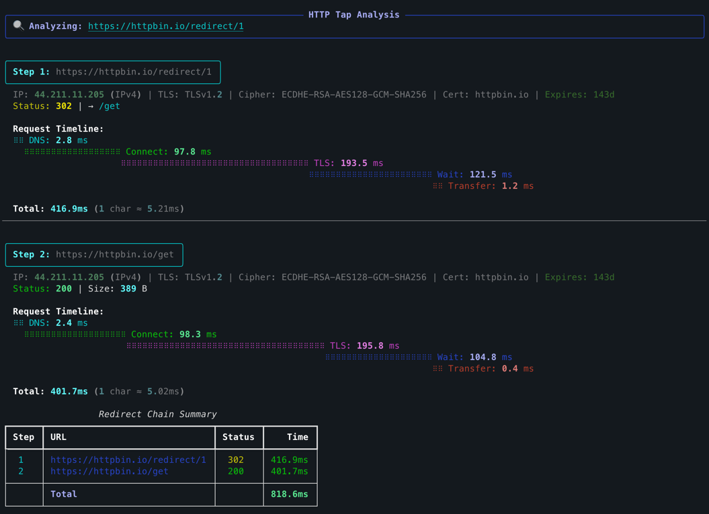

<p align="center">
  
</p>

<p align="center">
  <a href="https://trendshift.io/repositories/23438?utm_source=trendshift-badge&amp;utm_medium=badge&amp;utm_campaign=badge-trendshift-23438" target="_blank" rel="noopener noreferrer"></a>
</p>

# httptap

<table>
  <tr>
    <th>Releases</th>
    <th>CI &amp; Quality</th>
    <th>Security</th>
    <th>Project Info</th>
  </tr>
  <tr>
    <td>
      <a href="https://pypi.org/project/httptap/">
        
      </a><br />
      <a href="https://pypi.org/project/httptap/">
        
      </a>
    </td>
    <td>
      <a href="https://github.com/ozeranskii/httptap/actions/workflows/ci.yml">
        
      </a><br />
      <a href="https://codecov.io/github/ozeranskii/httptap">
        
      </a><br />
      <a href="https://codspeed.io/ozeranskii/httptap?utm_source=badge">
        
      </a>
    </td>
    <td>
      <a href="https://github.com/ozeranskii/httptap/actions/workflows/codeql.yml">
        
      </a><br />
      <a href="https://scorecard.dev/viewer/?uri=github.com/ozeranskii/httptap">
        
      </a><br />
      <a href="https://www.bestpractices.dev/projects/12474">
        
      </a><br />
      <a href="https://www.bestpractices.dev/projects/12474">
        
      </a>
    </td>
    <td>
      <a href="https://github.com/astral-sh/uv">
        
      </a><br />
      <a href="https://github.com/astral-sh/ruff">
        
      </a><br />
      <a href="https://github.com/ozeranskii/httptap/blob/main/LICENSE">
        
      </a>
    </td>
  </tr>
</table>

<p align="center">
  <a href="README.md">English</a> | <b>简体中文</b> | <a href="README.ja.md">日本語</a> | <a href="README.es.md">Español</a>
</p>

> **说明：** 本文档为社区翻译，可能落后于英文版本。如有出入，请以 [英文 README](README.md) 为准。

`httptap` 是一个基于 Rich 的命令行工具，它将一次 HTTP 请求拆解为每个有意义的阶段——DNS 解析、TCP 连接、TLS
握手、服务器等待、以及响应体传输，并以时间线表格、紧凑摘要或机器友好的指标形式呈现结果。它专为交互式故障排查、回归分析
以及性能基线记录而设计。

---

## 目录

- [亮点](#亮点)
- [如何对比](#如何对比)
- [环境要求](#环境要求)
- [安装](#安装)
  - [使用 Homebrew (macOS/Linux)](#使用-homebrew-macoslinux)
  - [使用 uvx（推荐）](#使用-uvx推荐)
  - [使用 uv](#使用-uv)
  - [使用 pip](#使用-pip)
  - [容器镜像](#容器镜像)
  - [从源码安装](#从源码安装)
  - [Shell 自动补全](#shell-自动补全)
- [快速开始](#快速开始)
  - [基础 GET 请求](#基础-get-请求)
  - [带数据的 POST 请求](#带数据的-post-请求)
  - [其他 HTTP 方法](#其他-http-方法)
  - [自定义请求头](#自定义请求头)
  - [重定向与 JSON 导出](#重定向与-json-导出)
  - [输出模式](#输出模式)
  - [高级用法](#高级用法)
- [SLO 阈值校验](#slo-阈值校验)
- [环境变量](#环境变量)
- [退出码](#退出码)
- [发布](#发布)
- [示例输出](#示例输出)
- [JSON 导出结构](#json-导出结构)
- [仅指标模式脚本化](#仅指标模式脚本化)
- [高级用法](#高级用法-1)
- [开发](#开发)
- [贡献](#贡献)
- [许可证](#许可证)
- [致谢](#致谢)
- [Star History](#star-history)

---

## 亮点

- **分阶段计时** —— 基于 httpcore 的 trace 钩子进行精确测量（当底层数据不可用时提供合理的回退估算）。
- **全部 HTTP 方法** —— GET、POST、PUT、PATCH、DELETE、HEAD、OPTIONS，均支持请求体。
- **请求体支持** —— 内联或从文件发送 JSON、XML 或任意数据，并自动检测 Content-Type。
- **IPv4/IPv6 感知** —— 解析器与 TLS 检查器会同时报告地址及其地址族。
- **TLS 洞察** —— 证书 CN、SAN、颁发者、序列号、有效期窗口与到期倒计时，以及加密套件和协议版本，均直接从当前
  连接自动采集（无需额外握手）。
- **多种输出模式** —— 丰富的瀑布图视图、紧凑的单行摘要，或用于脚本化的 `--metrics-only`。
- **JSON 导出** —— 持久化完整的分步数据（包含重定向链）以便后续处理。
- **SLO 阈值校验** —— `--slo total=500,ttfb=200` 可基于各阶段延迟预算为 CI 任务、cron 探针和就绪检查设置门禁；
  超标时以非零码退出，同时仍渲染完整报告。
- **可扩展** —— 为 DNS、TLS、计时、可视化和导出提供清晰的 Protocol 接口，便于插入自定义行为。

> 📣 <strong>httptap 用户专享：</strong>在 <a href="https://gitkraken.cello.so/vY8yybnplsZ"><strong>GitKraken Pro</strong></a> 上节省 50%。将 GitKraken Client、用于 VS Code 的 GitLens 以及强大的 CLI 工具组合在一起，加速每一次仓库工作流。

---

## 如何对比

| 特性 | `httptap` | `curl -w` | [`httpstat`](https://github.com/reorx/httpstat) | `httpie` |
|------|:---------:|:---------:|:-----------------------------------------------:|:--------:|
| 分阶段计时 (DNS/TCP/TLS/TTFB) | ✅ | ✅（格式串） | ✅ | ❌ |
| Rich 瀑布图可视化 | ✅ | ❌ | ⚠️ 文本条 | ❌ |
| 重定向链逐跳计时 | ✅ | ❌ | ❌ | ❌ |
| JSON 导出（机器可读） | ✅ | ✅ (`-w '%{json}'`) | ✅ (`--format json/jsonl`, v1 schema) | ❌（无指标） |
| 仅指标模式（脚本化） | ✅ | ✅ | ✅ (`--format json`) | ❌ |
| SLO 阈值校验 | ✅ (`--slo`) | ❌ | ✅ (`--slo total=500,...`) | ❌ |
| TLS 证书检查（CN、有效期） | ✅ | ⚠️ 经 `-v` | ❌ | ❌ |
| IPv4/IPv6 报告 | ✅ 地址族 | ⚠️ 经 `remote_ip` 提供 IP | ⚠️ 仅 IP (`remote_ip`/`remote_port`) | ❌ |
| HTTP/2 支持 | ✅ | ✅ | ⚠️ 经 curl 透传 | ⚠️ 仅插件 |
| 代理（带来源标注） | ✅ | ⚠️ 无来源标注 | ⚠️ 经 curl 透传 | ⚠️ 无来源标注 |
| 自定义 CA 包 | ✅ | ✅ | ⚠️ 经 curl 透传 | ✅ |
| 可扩展的 Python API | ✅ | ❌（pycurl ≠ 同一 API） | ❌ | ⚠️ 经 requests |
| 兼容 curl 的参数 | ✅ | — | ✅（透传） | ❌ |
| 零系统依赖 | ✅ | ✅ | 需要 curl | ✅ |

**如何选择：**
- **`httptap`** —— 交互式故障排查、回归分析，以及带结构化 JSON 的脚本化基线。
- **`curl -w`** —— curl 已是依赖时的一次性 shell 检查。
- **`httpstat`** —— 在已有 curl 基础上的快速可视化分解。
- **`httpie`** —— 通用的请求/响应探索，而非延迟剖析。

---

## 环境要求

- Python 3.10-3.15 (CPython)
- macOS、Linux 或 Windows（在 CPython 上测试）
- 除标准网络能力外无系统依赖
- 代码须遵循 Google Python 风格指南（文档字符串、格式化）。参见
  [Google Python Style Guide](https://google.github.io/styleguide/pyguide.html)

---

## 安装

### 使用 Homebrew (macOS/Linux)

```shell
brew install httptap
```

### 使用 `uvx`（推荐）

```shell
uvx --from "httptap[completion]" httptap https://example.com
```

### 使用 `uv`

```shell
uv pip install httptap
```

### 使用 `pip`

```shell
pip install httptap
```

### 容器镜像

```shell
docker run --rm ghcr.io/ozeranskii/httptap:latest https://example.com
```

多架构（linux/amd64、linux/arm64），使用 cosign 签名（无密钥 Sigstore），并附带 SLSA 构建来源证明。

### 从源码安装

```shell
git clone https://github.com/ozeranskii/httptap.git
cd httptap
uv venv
uv pip install .
```

---

### Shell 自动补全

#### Homebrew 安装

如果通过 Homebrew 安装 httptap，安装后即自动提供 shell 自动补全。只需重启 shell：

```shell
# 重启 shell 或重新加载配置
exec $SHELL
```

Homebrew 会自动将补全安装到：
- Bash：`$(brew --prefix)/etc/bash_completion.d/`
- Zsh：`$(brew --prefix)/share/zsh/site-functions/`

#### Python 包安装

如果通过 `pip` 或 `uv` 安装 httptap，需要安装可选的补全附加项：

1. 安装补全附加项：

   ```shell
   uv pip install "httptap[completion]"
   # 或
   pip install "httptap[completion]"
   ```

2. 激活你的虚拟环境：

   ```shell
   source .venv/bin/activate
   ```

3. 运行全局激活脚本以启用参数补全：

   ```shell
   activate-global-python-argcomplete
   ```

4. 重启 shell。补全现在应能在 bash 和 zsh 中生效。

**注意：** 全局激活脚本仅为 bash 和 zsh 提供参数补全。其他 shell 不在该脚本覆盖范围内，需单独配置。

#### 用法示例

补全安装完成后，可使用 `Tab` 自动补全命令和选项：

```shell
# 补全命令选项
httptap --<TAB>
# 显示：--method, --data, --follow, --timeout, --no-http2, --ignore-ssl, --cacert, --proxy, --header, --compact, --metrics-only, --json, --version, --help

# 输入部分选项后补全
httptap --fol<TAB>
# 补全为：httptap --follow

# 补全多个选项
httptap --follow --time<TAB>
# 补全为：httptap --follow --timeout
```

---

## 快速开始

### 基础 GET 请求

发起单次请求并显示丰富的瀑布图：

```shell
httptap https://httpbin.io/get
```

### 带数据的 POST 请求

发送 JSON 数据（自动检测 Content-Type）：

```shell
httptap https://httpbin.io/post --data '{"name": "John", "email": "john@example.com"}'
```

**注意：** 当提供了 `--data` 而未提供 `--method` 时，httptap 会自动切换为 POST（类似 curl）。

**兼容 curl 的参数：** httptap 接受最常见的 curl 语法，因此你常常可以直接用 `httptap` 替换 `curl`。别名包括：`-X/--request` 对应 `--method`、`-L/--location` 对应 `--follow`、`-m/--max-time` 对应 `--timeout`、`-k/--insecure` 对应 `--ignore-ssl`、`-x` 对应 `--proxy`、`--http1.1` 对应 `--no-http2`。（并非所有 curl 选项都受支持——替换命令时请只使用这些共有参数。）

从文件加载数据：

```shell
httptap https://httpbin.io/post --data @payload.json
```

显式指定方法（跳过自动 POST）：

```shell
httptap https://httpbin.io/post --method POST --data '{"status": "active"}'
```

### 其他 HTTP 方法

PUT 请求：

```shell
httptap https://httpbin.io/put --method PUT --data '{"key": "value"}'
```

PATCH 请求：

```shell
httptap https://httpbin.io/patch --method PATCH --data '{"field": "updated"}'
```

DELETE 请求：

```shell
httptap https://httpbin.io/delete --method DELETE
```

### 自定义请求头

添加自定义请求头（重复 `-H` 可传多个值）：

```shell
httptap \
  -H "Accept: application/json" \
  -H "Authorization: Bearer super-secret" \
  https://httpbin.io/bearer
```

### 重定向与 JSON 导出

跟随重定向链并将指标导出为 JSON：

```shell
httptap --follow --json out/report.json https://httpbin.io/redirect/2
```

### 输出模式

收集适合日志的紧凑（单行）计时：

```shell
httptap --compact https://httpbin.io/get
```

为脚本暴露原始指标：

```shell
httptap --metrics-only https://httpbin.io/get | tee timings.log
```

### 高级用法

编程用户可为高级场景注入自定义执行器。如果需要改变请求的执行方式（例如接入不同的 HTTP 栈或添加追踪），请提供你自己的 `RequestExecutor` 实现。

#### TLS 证书选项

在排查自签名端点时绕过 TLS 校验：

```shell
httptap --ignore-ssl https://self-signed.badssl.com
```

该参数会禁用证书校验并放宽许多握手约束，使得旧式端点（已过期/自签名/主机名不匹配、弱哈希、较老的 TLS
版本）仍能完成。某些已从现代 OpenSSL 构建中移除的算法（例如 RC4 或 3DES）可能仍不可用。请仅在可信网络中使用此模式。

为内部 API 使用自定义 CA 证书包：

```shell
httptap --cacert /path/to/company-ca.pem https://internal-api.company.com
```

当测试使用由系统默认信任库之外的自定义证书颁发机构 (CA) 签名的内部服务时，这非常有用。`--cacert` 选项（也可写作 `--ca-bundle`）接受一个 PEM 格式 CA 证书包的路径。

**注意：** `--ignore-ssl` 与 `--cacert` 互斥。使用 `--ignore-ssl` 可禁用所有校验，或使用 `--cacert` 以自定义 CA 包进行校验。

使用 `--cacert` 时，CLI 输出会以 `TLS CA: custom bundle` 标记该连接，且 JSON 导出会包含 `network.tls_custom_ca: true`，以便自动化检测自定义信任配置。

通过 HTTP/SOCKS 代理转发流量（显式指定优先于环境变量 `HTTP_PROXY`、`HTTPS_PROXY`、`NO_PROXY`）：

```shell
httptap --proxy socks5h://proxy.local:1080 https://httpbin.io/get
```

忽略所有代理环境变量并直连：

```shell
httptap --proxy "" https://httpbin.io/get
```

输出与 JSON 导出会包含代理 URI 及其来源，以便你确认实际使用的路径（例如 `(from arg --proxy)`、
`(from env HTTPS_PROXY)`、`(bypassed by env no_proxy)`）。

---

## SLO 阈值校验

使用 `--slo KEY=MS[,KEY=MS...]` 基于各阶段延迟预算为 CI 任务、cron 探针和 Kubernetes 就绪检查设置门禁：

```shell
httptap --slo total=500,ttfb=200 https://api.example.com/health
```

- 每个阈值都通过时以 `0` 退出。
- 当**最终成功的步骤**上至少有一个阈值被超出时以 `4` 退出（不评估中间重定向）。
- 规范格式错误（未知键、重复键、非正值、语法错误）时以 `64` 退出。
- 始终会渲染完整的瀑布图 / 紧凑 / JSON 输出，以便保留回归的证据。

支持的键：`dns`、`connect`、`tls`、`ttfb`、`wait`、`xfer`、`total`。

输出扩展：

- **Rich / 紧凑** —— 瀑布图后会有一个带边框的面板，列出阈值及任何违规项（实际值、阈值、超出量）。
- **`--metrics-only`** —— 最终成功的步骤会带有 `slo=pass` 或 `slo=fail slo_violations=<keys>` 标记。
- **`--json`** —— `summary.slo` 块包含 `pass`、`thresholds_ms`，以及每个违规项的 `{key, threshold_ms, actual_ms, delta_ms}`。

```shell
# CI 门禁 —— 仅在 SLO 违规时失败，容忍瞬时网络错误
httptap --slo total=2000,tls=300,ttfb=800 https://staging.example.com/
case $? in
  0) echo "healthy" ;;
  4) echo "SLO violation"; exit 1 ;;
  75) echo "network flake, retrying later" ;;
esac
```

完整规范、评估规则与实用示例：
[docs.httptap.dev/usage/slo](https://docs.httptap.dev/usage/slo/)。

---

## 环境变量

httptap 在运行时会读取以下环境变量。它们均可通过 CLI 参数覆盖，且每次请求实际使用的来源都会记录在输出和 JSON 导出中。

| 变量 | 用途 | 覆盖方式 |
|------|------|----------|
| `HTTP_PROXY` / `http_proxy` | 用于 `http://` 目标的代理 URL。 | `-x/--proxy` |
| `HTTPS_PROXY` / `https_proxy` | 用于 `https://` 目标的代理 URL。 | `-x/--proxy` |
| `ALL_PROXY` / `all_proxy` | 当协议专用变量未设置时的回退代理 URL。 | `-x/--proxy` |
| `NO_PROXY` / `no_proxy` | 逗号分隔的排除列表（支持 `*`、前导 `.`、精确匹配）。被排除的条目将直连。 | `--proxy ""` |
| `NO_COLOR` | 禁用所有 Rich 输出的 ANSI 颜色（遵循 [NO_COLOR](https://no-color.org) 约定）。 | — |
| `FORCE_COLOR` | 即使 stdout 非 TTY 也强制彩色输出（Rich 约定）。 | — |
| `TERM=dumb` | Rich 降级为纯文本渲染。 | — |

> 代理配置的优先级：显式 `-x/--proxy` → `--proxy ""`（禁用环境变量） →
> `HTTPS_PROXY`/`HTTP_PROXY`/`ALL_PROXY`（按协议匹配） →
> `NO_PROXY` 排除 → 直连。

---

## 退出码

httptap 遵循 BSD `sysexits.h` 约定，因此能与 shell 管道、CI 任务和 systemd 服务良好集成。

| 码 | 符号 | 含义 |
|:--:|------|------|
| `0` | `EX_OK` | 成功。 |
| `4` | — | SLO 阈值违规（请求成功但过慢）。 |
| `64` | `EX_USAGE` | 命令行参数无效。 |
| `70` | `EX_SOFTWARE` | 内部错误（意外异常、缺陷）。 |
| `75` | `EX_TEMPFAIL` | 网络 / TLS 错误（可能仍会渲染部分输出）。 |
| `128 + N` | 信号偏移 | 被信号 `N` 终止（例如 `130` 对应 `SIGINT` / Ctrl-C）。 |

示例 —— 仅在用法错误时使 CI 任务失败，容忍瞬时网络问题：

```shell
httptap --metrics-only https://api.example.com/health
rc=$?
if [ "$rc" = 64 ] || [ "$rc" = 70 ]; then
  exit "$rc"
fi
```

---


## 发布

### 前置条件

- 必须在仓库设置中配置 GitHub Environment `pypi`
- 为 `ozeranskii/httptap` 配置 PyPI Trusted Publishing

### 步骤

1. 从 GitHub Actions 触发 **Release** 工作流：
   - 提供确切版本号（例如 `0.3.0`），或
   - 选择递增类型：`patch`、`minor` 或 `major`
2. 工作流将会：
   - 使用 `uv version` 更新 `pyproject.toml` 中的版本
   - 使用 `git-cliff` 生成变更日志并更新 `CHANGELOG.md`
   - 提交更改并创建 git 标签
   - 在已打标签的版本上运行完整测试套件
   - 构建 wheel 和源码分发包
   - 通过 Syft 生成 CycloneDX 和 SPDX 格式的 SBOM
   - 附上当前的 OpenVEX 文档（`.vex/httptap.openvex.json`）
   - 通过 Trusted Publishing (OIDC) 发布到 PyPI
   - 创建带 wheel、sdist、SBOM 和 VEX 资产的 GitHub Release

---

## 示例输出


重定向摘要包含一个合计行：


---

## JSON 导出结构

```json
{
  "initial_url": "https://httpbin.io/redirect/2",
  "total_steps": 3,
  "steps": [
    {
      "url": "https://httpbin.io/redirect/2",
      "step_number": 1,
      "request": {
        "method": "GET",
        "headers": {},
        "body_bytes": 0
      },
      "timing": {
        "dns_ms": 8.947208058089018,
        "connect_ms": 96.97712492197752,
        "tls_ms": 194.56583401188254,
        "ttfb_ms": 445.9513339679688,
        "total_ms": 447.3437919514254,
        "wait_ms": 145.46116697601974,
        "xfer_ms": 1.392457983456552,
        "is_estimated": false
      },
      "network": {
        "ip": "44.211.11.205",
        "ip_family": "IPv4",
        "http_version": "HTTP/2.0",
        "tls_version": "TLSv1.2",
        "tls_cipher": "ECDHE-RSA-AES128-GCM-SHA256",
        "cert_cn": "httpbin.io",
        "cert_days_left": 143,
        "cert_sans": ["httpbin.io", "*.httpbin.io"],
        "cert_issuer": "WE1",
        "cert_serial": "05BB0F0AA84C8FECE0E72D805BA7A5D2B",
        "cert_not_before": "2025-04-01T00:00:00+00:00",
        "cert_not_after": "2025-09-01T00:00:00+00:00",
        "tls_verified": true,
        "tls_custom_ca": null,
        "proxy_url": null,
        "proxy_source": null
      },
      "response": {
        "status": 302,
        "bytes": 0,
        "content_type": null,
        "server": null,
        "date": "2025-10-23T19:20:36+00:00",
        "location": "/relative-redirect/1",
        "headers": {
          "access-control-allow-credentials": "true",
          "access-control-allow-origin": "*",
          "location": "/relative-redirect/1",
          "date": "Thu, 23 Oct 2025 19:20:36 GMT",
          "content-length": "0"
        }
      },
      "error": null,
      "note": null,
      "proxy": null
    },
    {
      "url": "https://httpbin.io/relative-redirect/1",
      "step_number": 2,
      "request": {
        "method": "GET",
        "headers": {},
        "body_bytes": 0
      },
      "timing": {
        "dns_ms": 2.6895420160144567,
        "connect_ms": 97.51500003039837,
        "tls_ms": 193.99016606621444,
        "ttfb_ms": 400.2034160075709,
        "total_ms": 400.60841606464237,
        "wait_ms": 106.00870789494365,
        "xfer_ms": 0.4050000570714474,
        "is_estimated": false
      },
      "network": {
        "ip": "44.211.11.205",
        "ip_family": "IPv4",
        "http_version": "HTTP/2.0",
        "tls_version": "TLSv1.2",
        "tls_cipher": "ECDHE-RSA-AES128-GCM-SHA256",
        "cert_cn": "httpbin.io",
        "cert_days_left": 143,
        "cert_sans": ["httpbin.io", "*.httpbin.io"],
        "cert_issuer": "WE1",
        "cert_serial": "05BB0F0AA84C8FECE0E72D805BA7A5D2B",
        "cert_not_before": "2025-04-01T00:00:00+00:00",
        "cert_not_after": "2025-09-01T00:00:00+00:00",
        "tls_verified": true,
        "tls_custom_ca": null,
        "proxy_url": null,
        "proxy_source": null
      },
      "response": {
        "status": 302,
        "bytes": 0,
        "content_type": null,
        "server": null,
        "date": "2025-10-23T19:20:36+00:00",
        "location": "/get",
        "headers": {
          "access-control-allow-credentials": "true",
          "access-control-allow-origin": "*",
          "location": "/get",
          "date": "Thu, 23 Oct 2025 19:20:36 GMT",
          "content-length": "0"
        }
      },
      "error": null,
      "note": null,
      "proxy": null
    },
    {
      "url": "https://httpbin.io/get",
      "step_number": 3,
      "request": {
        "method": "GET",
        "headers": {},
        "body_bytes": 0
      },
      "timing": {
        "dns_ms": 2.643457963131368,
        "connect_ms": 97.36416593659669,
        "tls_ms": 197.3062080796808,
        "ttfb_ms": 403.2038329169154,
        "total_ms": 403.9644579170272,
        "wait_ms": 105.89000093750656,
        "xfer_ms": 0.7606250001117587,
        "is_estimated": false
      },
      "network": {
        "ip": "52.70.33.41",
        "ip_family": "IPv4",
        "http_version": "HTTP/2.0",
        "tls_version": "TLSv1.2",
        "tls_cipher": "ECDHE-RSA-AES128-GCM-SHA256",
        "cert_cn": "httpbin.io",
        "cert_days_left": 143,
        "cert_sans": ["httpbin.io", "*.httpbin.io"],
        "cert_issuer": "WE1",
        "cert_serial": "05BB0F0AA84C8FECE0E72D805BA7A5D2B",
        "cert_not_before": "2025-04-01T00:00:00+00:00",
        "cert_not_after": "2025-09-01T00:00:00+00:00",
        "tls_verified": true,
        "tls_custom_ca": null,
        "proxy_url": null,
        "proxy_source": null
      },
      "response": {
        "status": 200,
        "bytes": 389,
        "content_type": "application/json; charset=utf-8",
        "server": null,
        "date": "2025-10-23T19:20:37+00:00",
        "location": null,
        "headers": {
          "access-control-allow-credentials": "true",
          "access-control-allow-origin": "*",
          "content-type": "application/json; charset=utf-8",
          "date": "Thu, 23 Oct 2025 19:20:37 GMT",
          "content-length": "389"
        }
      },
      "error": null,
      "note": null,
      "proxy": null
    }
  ],
  "summary": {
    "total_time_ms": 1251.916665933095,
    "final_status": 200,
    "final_url": "https://httpbin.io/get",
    "final_bytes": 389,
    "errors": 0
  }
}
```

## 仅指标模式脚本化

```shell
httptap --metrics-only https://httpbin.io/get
```

```terminaloutput
Step 1: dns=30.1 connect=97.3 tls=199.0 ttfb=472.2 total=476.0 status=200 bytes=389 ip=44.211.11.205 family=IPv4 tls_version=TLSv1.2 proxy=direct
```

---

## 高级用法

### 自定义实现

替换成你自己的解析器或 TLS 检查器（任何满足 `httptap.interfaces` 中 Protocol 的实现均可）：

```python
from httptap import HTTPTapAnalyzer, SystemDNSResolver


class HardcodedDNS(SystemDNSResolver):
    def resolve(self, host, port, timeout):
        return "93.184.216.34", "IPv4", 0.1


analyzer = HTTPTapAnalyzer(dns_resolver=HardcodedDNS())
steps = analyzer.analyze_url("https://httpbin.io")
```

---

## 开发

```shell
git clone https://github.com/ozeranskii/httptap.git
cd httptap
uv sync
uv run pytest
uv run ruff check
uv run ruff format .
```

测试期望有外网访问；离线运行时可 mock `SystemDNSResolver` / `SocketTLSInspector`。

---

## 贡献

1. Fork 并克隆仓库。
2. 创建功能分支。
3. 提交前运行 `pytest` 和 `ruff`。
4. 提交带清晰描述以及任何相关截图或基准数据的 pull request。

我们欢迎缺陷报告、功能提案、文档改进，以及富有创意的新可视化或导出器。

---

## 许可证

Apache License 2.0 © Sergei Ozeranskii。详见 [LICENSE](https://github.com/ozeranskii/httptap/blob/main/LICENSE)。

---

## 致谢

- 构建于众多出色的库之上：[httpx](https://www.python-httpx.org/)、[httpcore](https://github.com/encode/httpcore)、
  [dnspython](https://www.dnspython.org/) 和 [Rich](https://github.com/Textualize/rich)。
- 灵感来自围绕 Web 性能的工具生态（例如 DevTools 瀑布图、`curl --trace`）。
- 特别感谢每一位提交 issue、分享想法或贡献补丁的人。

---

## Star History

<a href="https://www.star-history.com/?repos=ozeranskii%2Fhttptap&type=date&legend=top-left">
 <picture>
   <source media="(prefers-color-scheme: dark)" srcset="https://api.star-history.com/chart?repos=ozeranskii/httptap&type=date&theme=dark&legend=top-left&sealed_token=l9nG3PE0bX5aj34TLoeySlfh-_SB3q51PgWOaU2CmnMGqBBvE8afuR1znzOdI0Vffj7Eh07VC1QPIOro5aeWb1B8BVdWOtnFhVcsJ22WFSfZkZWNx0v74LF--vP-rnm_WSMwooWGpUCQK24Anw5-qoqR2ItPauLxdsBhDZwLKJMEX0J46yaHWtJ-D1jc" />
   <source media="(prefers-color-scheme: light)" srcset="https://api.star-history.com/chart?repos=ozeranskii/httptap&type=date&legend=top-left&sealed_token=l9nG3PE0bX5aj34TLoeySlfh-_SB3q51PgWOaU2CmnMGqBBvE8afuR1znzOdI0Vffj7Eh07VC1QPIOro5aeWb1B8BVdWOtnFhVcsJ22WFSfZkZWNx0v74LF--vP-rnm_WSMwooWGpUCQK24Anw5-qoqR2ItPauLxdsBhDZwLKJMEX0J46yaHWtJ-D1jc" />
   
 </picture>
</a>
