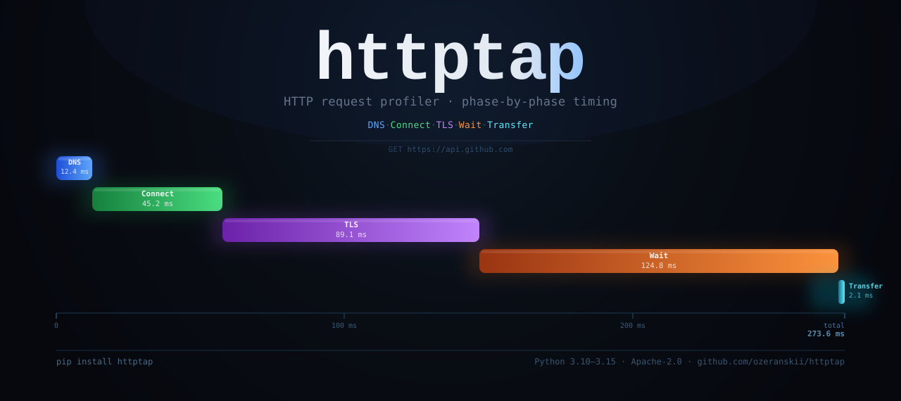
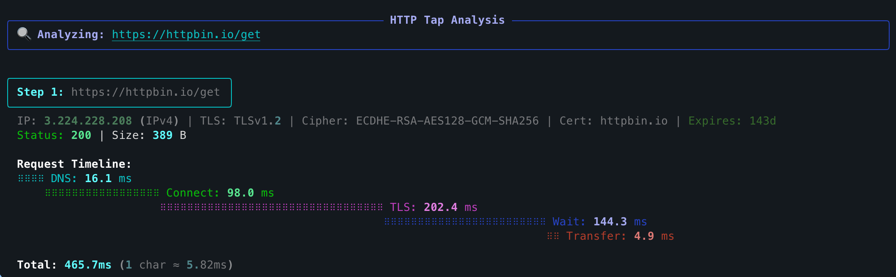

<p align="center">
  
</p>

# httptap

<div style="text-align: center; margin-bottom: 2em;">
  <p>
    <a href="https://pypi.org/project/httptap/"></a>
    <a href="https://pypi.org/project/httptap/"></a>
    <a href="https://github.com/ozeranskii/httptap/actions/workflows/ci.yml"></a>
    <a href="https://codecov.io/github/ozeranskii/httptap"></a>
  </p>
</div>

`httptap` は、HTTP リクエストをあらゆる意味のあるフェーズ（DNS、TCP 接続、TLS ハンドシェイク、サーバー待機、ボディ転送）に分解し、その結果をタイムラインテーブル、コンパクトなサマリー、またはマシンで扱いやすいメトリクスとして描画する Rich 製の CLI です。対話的なトラブルシューティング、リグレッション分析、パフォーマンスのベースライン記録のために設計されています。

!!! tip "特別オファー"
    <div style="text-align: center; margin-bottom: 0.6em;">
      :gift:{ style="font-size: 1.5em; margin-right: 0.35em; vertical-align: middle;" } <span style="font-weight: 700; font-size: 1.05em;">GitKraken Pro を 50% 割引</span>
    </div>

    <div style="text-align: center; font-size: 0.95em; margin-bottom: 1em; line-height: 1.5;">
      GitKraken Client、VS Code 向け GitLens、そして強力な CLI ツールをまとめて、あらゆるリポジトリのワークフローを加速しましょう。
    </div>

    <div style="display: block; text-align: center; margin-top: 1em; margin-bottom: 0.8em;">
      [:fontawesome-solid-bolt: 50% 割引を受け取る](https://gitkraken.cello.so/vY8yybnplsZ){ .md-button .md-button--primary style="font-size: 0.95em; padding: 0.6em 1.8em; font-weight: 600; letter-spacing: 0.01em; background: linear-gradient(135deg, #3949ab 0%, #5e35b1 100%); border: none; box-shadow: 0 2px 8px rgba(57, 73, 171, 0.3);" }
    </div>

    <small style="display: block; margin-top: 0.6em; opacity: 0.75; font-size: 0.85em; text-align: center;">*httptap コミュニティ限定*</small>

## ハイライト

- **フェーズごとのタイミング計測** – httpcore のトレースフックから構築した精密な計測（低レベルのデータが利用できない場合には妥当なフォールバックを使用）
- **すべての HTTP メソッド** – GET、POST、PUT、PATCH、DELETE、HEAD、OPTIONS をリクエストボディ対応でサポート
- **リクエストボディ対応** – JSON、XML、または任意のデータをインラインまたはファイルから送信し、Content-Type を自動検出
- **IPv4/IPv6 対応** – リゾルバと TLS インスペクタがアドレスとそのファミリの両方を報告
- **TLS インサイト** – 証明書の CN、SAN、発行者、シリアル、有効期間と有効期限までのカウントダウン、加えて暗号スイートとプロトコルバージョンを、ライブ接続から自動的に取得（追加のハンドシェイクは不要）
- **複数の出力モード** – リッチなウォーターフォールビュー、コンパクトな 1 行サマリー、またはスクリプト向けの `--metrics-only`
- **JSON エクスポート** – 後処理のためにステップの全データ（リダイレクトチェーンを含む）を保存
- **拡張可能** – DNS、TLS、タイミング、可視化、エクスポート向けのクリーンな Protocol インターフェースにより、独自の挙動を差し込み可能

## クイックサンプル

**GET リクエスト:**
```bash
httptap https://httpbin.io/get
```

**JSON データ付きの POST:**
```bash
httptap --data '{"name": "John"}' https://httpbin.io/post
```



## 主な機能

### リッチなウォーターフォールの可視化

Rich を活用した美しいターミナル UI で、HTTP リクエストの各フェーズの詳細なタイミングの内訳を表示します。

### 複数の出力形式

- **リッチモード**（デフォルト）: 色付きで整形された美しいウォーターフォールテーブル
- **コンパクトモード**（`--compact`）: ログに適した 1 行サマリー
- **メトリクスモード**（`--metrics-only`）: スクリプトや自動化のための生のメトリクス
- **JSON エクスポート**（`--json`）: リダイレクトチェーンを含むリクエストの全データ

### 高度なネットワークインサイト

- IP ファミリ検出（IPv4/IPv6）付きの名前解決のタイミング
- TCP 接続確立のタイミング
- 証明書情報付きの TLS ハンドシェイク分析
- 最初のバイトまでの時間（TTFB）の計測
- レスポンスボディ転送のタイミング

### リダイレクトチェーンのサポート

`--follow` フラグで HTTP のリダイレクトを追跡し、チェーンの各ステップのタイミングの内訳を確認できます。

## 次のステップ

<div class="grid cards" markdown>

-   :material-download:{ .lg .middle } **[インストール](getting-started/installation.md)**

    ---

    httptap を数秒で使い始める

-   :material-lightning-bolt:{ .lg .middle } **[クイックスタート](getting-started/quick-start.md)**

    ---

    シンプルな例で基本を学ぶ

-   :material-console:{ .lg .middle } **[使い方ガイド](usage/basic.md)**

    ---

    すべての機能とオプションを探索する

-   :material-api:{ .lg .middle } **[API リファレンス](api/overview.md)**

    ---

    独自コンポーネントで httptap を拡張する

</div>

## 動作要件

- Python 3.10-3.15
- macOS、Linux、または Windows
- 標準的なネットワーク機能以外にシステム依存関係は不要

## ライセンス

Apache License 2.0 © Sergei Ozeranskii

## つながる

実務経験からの知見を得るには、作者をフォローしてください:

- :fontawesome-brands-telegram:{ .telegram } **[Telegram チャンネル](https://t.me/sergeiozeranskii)** - 開発、DevOps、アーキテクチャ、セキュリティ。誇張なしの実体験と実践的な知見。
- :fontawesome-brands-github: **[GitHub](https://github.com/ozeranskii)** - オープンソースプロジェクトとコントリビューション

## 謝辞

素晴らしいライブラリの肩の上に築かれています:

- [httpx](https://www.python-httpx.org/) - モダンな HTTP クライアント
- [httpcore](https://github.com/encode/httpcore) - 低レベルの HTTP プロトコル実装
- [dnspython](https://www.dnspython.org/) - Python 向けの DNS ツールキット
- [Rich](https://github.com/Textualize/rich) - 美しいターミナル整形
