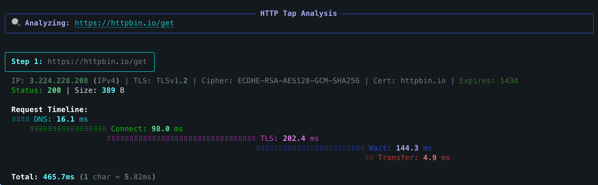

# httptap

<div style="text-align: center; margin-bottom: 2em;">
  <p>
    <a href="https://pypi.org/project/httptap/"></a>
    <a href="https://pypi.org/project/httptap/"></a>
    <a href="https://github.com/ozeranskii/httptap/actions/workflows/ci.yml"></a>
    <a href="https://codecov.io/github/ozeranskii/httptap"></a>
  </p>
</div>

`httptap` is a rich-powered CLI that dissects an HTTP request into every meaningful phase—DNS, TCP connect, TLS
handshake, server wait, and body transfer—and renders the results as a timeline table, compact summary, or
machine-friendly metrics. It is designed for interactive troubleshooting, regression analysis, and recording of
performance baselines.

!!! tip "Special Offer"
    <div style="text-align: center; margin-bottom: 0.6em;">
      :gift:{ style="font-size: 1.5em; margin-right: 0.35em; vertical-align: middle;" } <span style="font-weight: 700; font-size: 1.05em;">Save 50% on GitKraken Pro</span>
    </div>

    <div style="text-align: center; font-size: 0.95em; margin-bottom: 1em; line-height: 1.5;">
      Bundle GitKraken Client, GitLens for VS Code, and powerful CLI tools to accelerate every repo workflow.
    </div>

    <div style="display: block; text-align: center; margin-top: 1em; margin-bottom: 0.8em;">
      [:fontawesome-solid-bolt: Claim 50% Discount](https://gitkraken.cello.so/vY8yybnplsZ){ .md-button .md-button--primary style="font-size: 0.95em; padding: 0.6em 1.8em; font-weight: 600; letter-spacing: 0.01em; background: linear-gradient(135deg, #3949ab 0%, #5e35b1 100%); border: none; box-shadow: 0 2px 8px rgba(57, 73, 171, 0.3);" }
    </div>

    <small style="display: block; margin-top: 0.6em; opacity: 0.75; font-size: 0.85em; text-align: center;">*Exclusive for httptap community*</small>

## Highlights

- **Phase-by-phase timing** – precise measurements built from httpcore trace hooks (with sane fallbacks when metal-level
  data is unavailable)
- **IPv4/IPv6 aware** – the resolver and TLS inspector report both the address and its family
- **TLS insights** – certificate CN, expiry countdown, cipher suite, and protocol version are captured automatically
- **Multiple output modes** – rich waterfall view, compact single-line summaries, or `--metrics-only` for scripting
- **JSON export** – persist full step data (including redirect chains) for later processing
- **Extensible** – clean Protocol interfaces for DNS, TLS, timing, visualization, and export so you can plug in custom
  behavior

## Quick Example

```bash
httptap https://httpbin.io
```



## Key Features

### Rich Waterfall Visualization

View detailed timing breakdown for each phase of the HTTP request with a beautiful terminal UI powered by Rich.

### Multiple Output Formats

- **Rich mode** (default): Beautiful waterfall table with colors and formatting
- **Compact mode** (`--compact`): Single-line summaries suitable for logs
- **Metrics mode** (`--metrics-only`): Raw metrics for scripting and automation
- **JSON export** (`--json`): Full request data including redirect chains

### Advanced Network Insights

- DNS resolution timing with IP family detection (IPv4/IPv6)
- TCP connection establishment timing
- TLS handshake analysis with certificate information
- Time to first byte (TTFB) measurement
- Response body transfer timing

### Redirect Chain Support

Follow HTTP redirects and see timing breakdown for each step in the chain with `--follow` flag.

## What's Next?

<div class="grid cards" markdown>

-   :material-download:{ .lg .middle } **[Installation](getting-started/installation.md)**

    ---

    Get started with httptap in seconds

-   :material-lightning-bolt:{ .lg .middle } **[Quick Start](getting-started/quick-start.md)**

    ---

    Learn the basics with simple examples

-   :material-console:{ .lg .middle } **[Usage Guide](usage/basic.md)**

    ---

    Explore all features and options

-   :material-api:{ .lg .middle } **[API Reference](api/overview.md)**

    ---

    Extend httptap with custom components

</div>

## Requirements

- Python 3.13+
- macOS, Linux, or Windows
- No system dependencies beyond standard networking

## License

Apache License 2.0 © Sergei Ozeranskii

## Connect

Follow the author for insights from real-world experience:

- :fontawesome-brands-telegram:{ .telegram } **[Telegram Channel](https://t.me/sergeiozeranskii)** - Development, DevOps, architecture, and security. Real experience and practical insights without fluff.
- :fontawesome-brands-github: **[GitHub](https://github.com/ozeranskii)** - Open source projects and contributions

## Acknowledgements

Built on the shoulders of fantastic libraries:

- [httpx](https://www.python-httpx.org/) - Modern HTTP client
- [httpcore](https://github.com/encode/httpcore) - Low-level HTTP protocol implementation
- [Rich](https://github.com/Textualize/rich) - Beautiful terminal formatting
